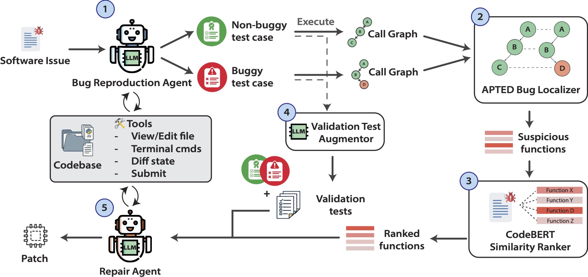

<h1>
   
  XAgent: eXecution-guided Agentic AI for Accurate Localization & Resolution of GitHub Issues
</h1>

## Overview

<p align="center">
  
</p>

XAgent is an autonomous agent system for automated software bug reproduction and repair. Our approach operates in three phases:

1. **Reproduce Agent**: Reads the issue description, crafts two minimally different tests (one expected to pass, one expected to fail), executes them to confirm the bug, and anchors the process in observable behavior.

2. **Call-Graph Bug Localizer**: Executes both tests under tracing to build dynamic call graphs, contrasts them using issue-aware keywords to surface divergent functions, then prioritizes candidates using a general code-text encoder and lightweight historical signals.

3. **Repair Agent**: A one-shot test augmentor broadens validation, then the repair agent iterates over top-ranked functions to synthesize candidate fixes, executing the full test suite until a validated patch is generated.

## Installation

Clone the repository:

```bash
git clone https://github.com/xagent-se/XAgent.git
cd XAgent
```

Install the package:

```bash
python -m pip install --upgrade pip
pip install --editable .
```

## Replication

To replicate our results:

1. Specify issues in SWE-bench you wanted to test in `selected_issues.yml`
2. Run the evaluation script:

```bash
./run.sh
```


## Citation

If you use XAgent in your research, please cite:

```bibtex
@article{2025xagent,
  title={XAgent: eXecution-guided Agentic AI for Accurate Localization \& Resolution of GitHub Issues},
  journal={arXiv preprint arXiv:XXXX.XXXXX},
  year={2025}
}
```

## Acknowledgements

This project builds upon the [SWE-agent](https://github.com/SWE-agent/SWE-agent) framework. We especially thank the SWE-agent team for making their code publicly available.

## License

This project is based on SWE-agent, which is licensed under the MIT License.

See the [LICENSE](LICENSE) file for the full MIT License text.
